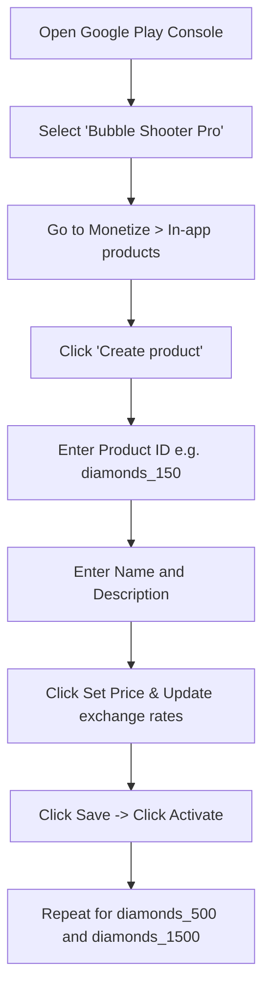

# Google Play Store In-App Purchases (IAP) Listing & Setup Guide
**Game:** Bubble Shooter Pro  
**Package Name:** `com.redcodersgroup.bubbleshooter`  
**Billing Client Version:** `7.1.1`  
**Base Conversion Rate:** `₹0.50 INR / Diamond`  

---

## 📋 Table of Contents
1. [Prerequisites](#1-prerequisites)
2. [Product Listing Catalog & Real Pricing Data](#2-product-listing-catalog--real-pricing-data)
3. [Step-by-Step Play Console Product Creation](#3-step-by-step-play-console-product-creation)
4. [Setting Up Country-Specific Localized Pricing](#4-setting-up-country-specific-localized-pricing)
5. [License Testing Setup (Free Sandbox Testing)](#5-license-testing-setup-free-sandbox-testing)
6. [App Implementation Verification](#6-app-implementation-verification)
7. [Troubleshooting & Common Errors](#7-troubleshooting--common-errors)

---

## 1. Prerequisites

Before creating products in the Google Play Console:
1. **Google Payments Merchant Profile**: Your Google Play Console developer account must have an active Google Payments Merchant profile linked (**Settings > Payments profile**).
2. **Draft / Internal Testing Release**: You must upload at least one signed build (AAB or APK) containing the `com.android.billingclient:billing:7.1.1` dependency and `com.android.vending.BILLING` permission to an **Internal testing** track or **Closed testing** track.
3. **App Status**: The app listing in the Play Console must have accepted privacy policies and completed the Content Rating questionnaire.

---

## 2. Product Listing Catalog & Real Pricing Data

Configure each product as a **Managed product / In-app product (Consumable)** using the exact data below:

### Product 1: Pouch of Diamonds (150)
- **Product ID (SKU):** `diamonds_150`
- **Product Type:** In-app product (Consumable)
- **Product Name:** `Pouch of Diamonds (150)`
- **Short Description:** `150 Sparkling Diamonds to refill lives, get extra shots, and unlock powerups!`
- **Rate Breakdown:** `150 Diamonds × ₹0.50 = ₹75.00 INR`

| Country / Region | Currency | Recommended Tier Price |
| :--- | :--- | :--- |
| **India** | `INR (₹)` | **₹75.00** |
| **United States** | `USD ($)` | **$0.99** |
| **Eurozone** | `EUR (€)` | **€0.99** |
| **United Kingdom** | `GBP (£)` | **£0.89** |
| **Canada** | `CAD (C$)` | **C$1.29** |
| **Australia** | `AUD (A$)` | **A$1.49** |
| **Japan** | `JPY (¥)` | **¥140** |
| **Brazil** | `BRL (R$)` | **R$ 4.99** |

---

### Product 2: Sack of Diamonds (500)
- **Product ID (SKU):** `diamonds_500`
- **Product Type:** In-app product (Consumable)
- **Product Name:** `Sack of Diamonds (500)`
- **Short Description:** `Popular pack! 500 Diamonds to keep your winning streak going with bombs and fireballs.`
- **Rate Breakdown:** `500 Diamonds × ₹0.50 = ₹250.00 INR`

| Country / Region | Currency | Recommended Tier Price |
| :--- | :--- | :--- |
| **India** | `INR (₹)` | **₹250.00** |
| **United States** | `USD ($)` | **$2.99** |
| **Eurozone** | `EUR (€)` | **€2.99** |
| **United Kingdom** | `GBP (£)` | **£2.49** |
| **Canada** | `CAD (C$)` | **C$3.99** |
| **Australia** | `AUD (A$)` | **A$4.49** |
| **Japan** | `JPY (¥)` | **¥450** |
| **Brazil** | `BRL (R$)` | **R$ 14.99** |

---

### Product 3: Chest of Diamonds (1,500)
- **Product ID (SKU):** `diamonds_1500`
- **Product Type:** In-app product (Consumable)
- **Product Name:** `Chest of Diamonds (1,500)`
- **Short Description:** `Best value! 1,500 Diamonds to unlock unlimited boosters, rainbow bubbles, and complete all stages.`
- **Rate Breakdown:** `1,500 Diamonds × ₹0.50 = ₹750.00 INR`

| Country / Region | Currency | Recommended Tier Price |
| :--- | :--- | :--- |
| **India** | `INR (₹)` | **₹750.00** |
| **United States** | `USD ($)` | **$6.99** |
| **Eurozone** | `EUR (€)` | **€6.99** |
| **United Kingdom** | `GBP (£)` | **£5.99** |
| **Canada** | `CAD (C$)` | **C$9.99** |
| **Australia** | `AUD (A$)` | **A$10.99** |
| **Japan** | `JPY (¥)` | **¥1,050** |
| **Brazil** | `BRL (R$)` | **R$ 39.99** |

---

## 3. Step-by-Step Play Console Product Creation

Follow this walkthrough inside [Google Play Console](https://play.google.com/console):



### Detailed Steps:

1. In the Play Console sidebar, navigate to **Monetize with Play** > **Products** > **In-app products**.
2. Click the blue **Create product** button in the top right.
3. In the form, enter:
   - **Product ID**: Type `diamonds_150` *(Caution: Case-sensitive, must match codebase)*
   - **Name**: `Pouch of Diamonds (150)`
   - **Description**: `150 Sparkling Diamonds to refill lives, get extra shots, and unlock powerups!`
4. Scroll to the **Price** section and click **Set price**:
   - Set Default Currency: **INR (₹)** or **USD ($)**.
   - Enter **₹75** (or **$0.99**).
   - Check the box **"Update exchange rates"** to let Google automatically calculate prices for all other 170+ countries using current FX rates and local tax requirements.
   - Click **Apply prices**.
5. Click **Save** in the bottom-right corner.
6. Once saved, click **Activate** at the bottom of the page.
7. Repeat the exact same process for `diamonds_500` (₹250 / $2.99) and `diamonds_1500` (₹750 / $6.99).

---

## 4. Setting Up Country-Specific Localized Pricing

Google Play automatically handles currency conversions and local sales taxes (e.g., GST in India, VAT in Europe, Sales Tax in US states). 

If you want to manually customize prices for specific countries:
1. In the product editing screen, under **Price**, click **Edit prices**.
2. Search for the specific country (e.g., **India**, **United States**, **Germany**).
3. Override the default converted price with your preferred price tier.
4. Click **Apply prices** and **Save**.

### How the App Displays Localized Prices
The app queries Google Play using Billing Client v7:
```java
ProductDetails.OneTimePurchaseOfferDetails offer = 
    productDetails.getOneTimePurchaseOfferDetails();
String localizedPrice = offer.getFormattedPrice(); // e.g. "$0.99", "₹75.00", "€0.99"
```
The button text in `ShopActivity` and `StoreDialog` will automatically update to show the exact currency symbol and format of the user's Google Play account.

---

## 5. License Testing Setup (Free Sandbox Testing)

To test purchases end-to-end on your test phone without paying real money:

1. In Play Console, open **Setup** > **License testing** (from the left menu).
2. Under **License testers**, add your personal Google account email(s) (the Google account logged into your testing Android device).
3. Set **License response** to `RESPOND_NORMALLY`.
4. Click **Save changes**.
5. On your testing device:
   - Ensure you are logged into Google Play with the tester email address.
   - Launch the game, open the Shop, and tap on any diamond pack.
   - Google Play will present the purchase bottom sheet showing **"Test card, always approves"** with price **$0.00 (Test)**.
   - Tap **1-tap buy**.
   - The diamonds will be credited immediately, consumed automatically, and backed up to Google Play Games Cloud Save.

---

## 6. App Implementation Verification

| Component | File Reference | Responsibility |
| :--- | :--- | :--- |
| **Billing Manager** | [`IapBillingManager.java`](file:///d:/projects/bubble%20shooter%20pro/BubbleShooterpro/app/src/main/java/com/redcodersgroup/bubbleshooter/store/IapBillingManager.java) | Connects to Google Play Billing, queries SKU details, launches flow, consumes purchases, and calls cloud save. |
| **Store Constants** | [`StoreManager.java`](file:///d:/projects/bubble%20shooter%20pro/BubbleShooterpro/app/src/main/java/com/redcodersgroup/bubbleshooter/store/StoreManager.java) | Defines SKU IDs, base INR conversion rate (0.5), and fallback labels. |
| **Shop Screen** | [`ShopActivity.java`](file:///d:/projects/bubble%20shooter%20pro/BubbleShooterpro/app/src/main/java/com/redcodersgroup/bubbleshooter/ui/ShopActivity.java) | Dedicated store screen displaying diamond packs with dynamic localized prices. |
| **Store Dialog** | [`StoreDialog.java`](file:///d:/projects/bubble%20shooter%20pro/BubbleShooterpro/app/src/main/java/com/redcodersgroup/bubbleshooter/ui/dialogs/StoreDialog.java) | In-game modal dialog for purchasing diamonds and boosters directly during gameplay. |
| **Cloud Save** | [`CloudSaveManager.java`](file:///d:/projects/bubble%20shooter%20pro/BubbleShooterpro/app/src/main/java/com/redcodersgroup/bubbleshooter/auth/CloudSaveManager.java) | Automatically persists newly purchased diamond balances to Google Play Games Cloud. |

---

## 7. Troubleshooting & Common Errors

### Error: `Billing Response Code 3 (BILLING_UNAVAILABLE)`
- **Cause:** Google Play Store app is outdated or not signed in on the device/emulator.
- **Solution:** Test on a real device with Google Play Store installed and a logged-in Google account.

### Error: `Billing Response Code 4 (ITEM_UNAVAILABLE)`
- **Cause:** 
  1. The Product ID was typed incorrectly (must match `diamonds_150`, `diamonds_500`, `diamonds_1500`).
  2. The product is not in **Active** status on Google Play Console.
  3. The app is not uploaded to an active test track (Internal/Closed testing) with the same `applicationId` and signing key.
- **Solution:** Ensure the product is activated in Play Console and that your device account is added as a tester in the test track.

### Error: `Billing Response Code 7 (ITEM_ALREADY_OWNED)`
- **Cause:** A previous purchase was not consumed.
- **Solution:** [`IapBillingManager`](file:///d:/projects/bubble%20shooter%20pro/BubbleShooterpro/app/src/main/java/com/redcodersgroup/bubbleshooter/store/IapBillingManager.java#L80) automatically queries unconsumed purchases upon connection and consumes them to unblock repeat purchases.
