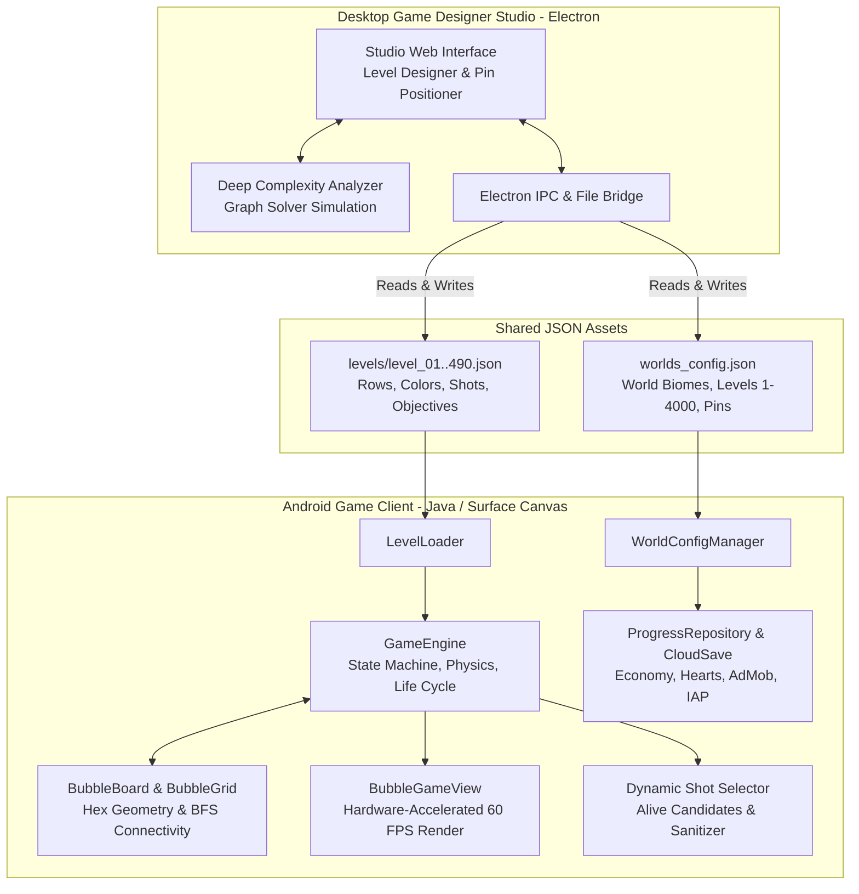
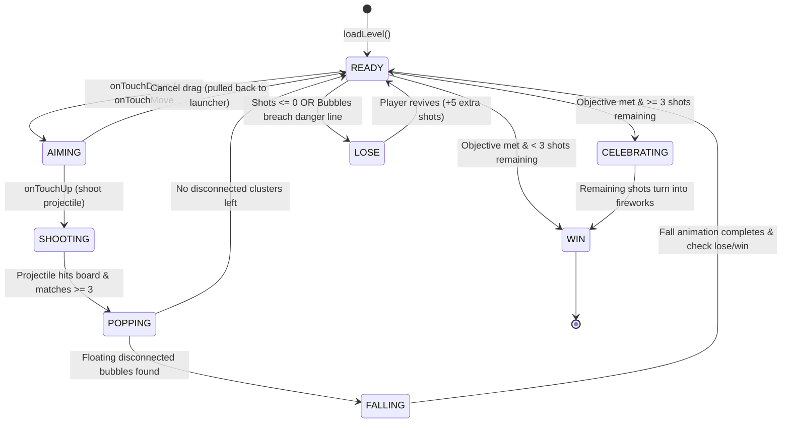
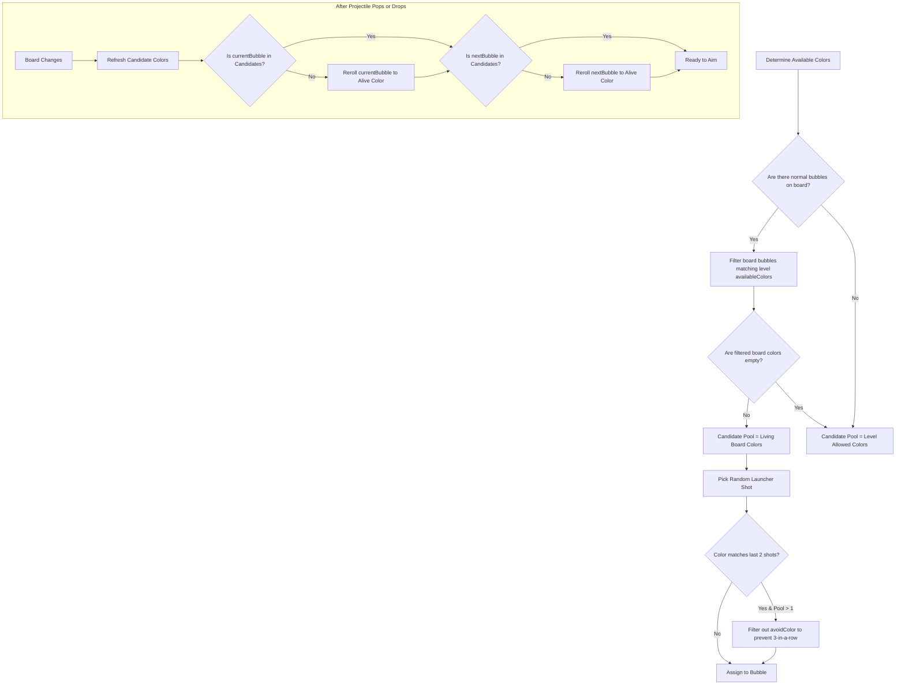
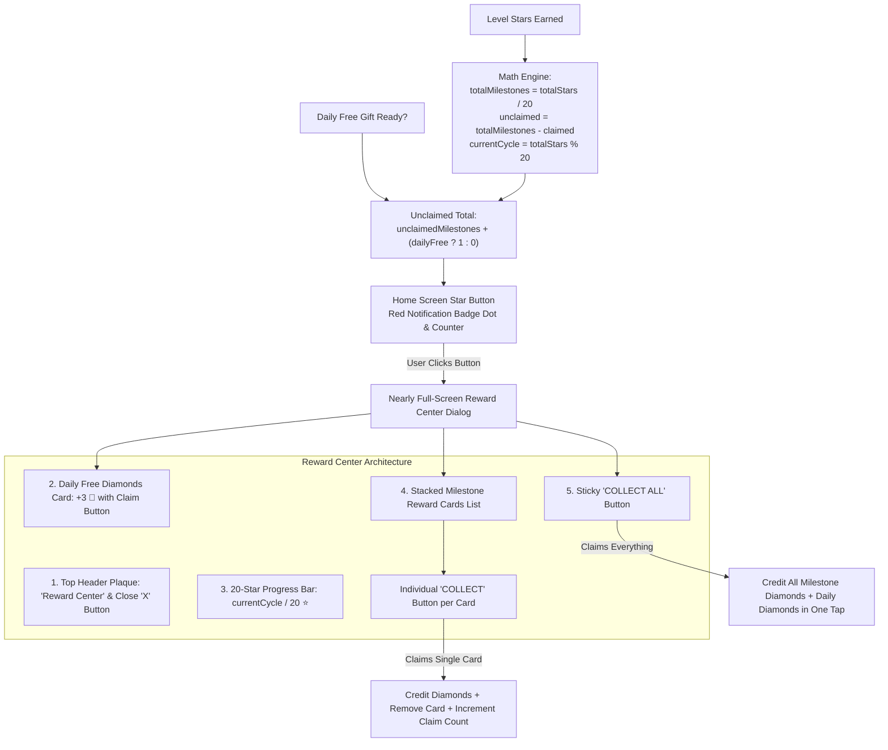
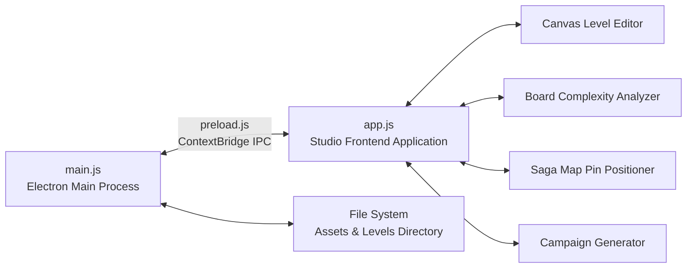

# Bubble Shooter Pro — Complete Technical Architecture, Operation & Maintenance Manual

> **Version**: 1.0.0 (Production Master)  
> **Target Platforms**: Android (Google Play Store), Windows (Desktop Game Designer Studio)  
> **Author**: RedCoders Group & Engineering Team  
> **Last Updated**: October 2026  

---

## Table of Contents
1. [Repository & Project Overview](#1-repository--project-overview)
2. [End-to-End System Architecture](#2-end-to-end-system-architecture)
3. [Android Game Engine (`BubbleShooterpro`)](#3-android-game-engine-bubbleshooterpro)
   - 3.1 Hexagonal Grid Math & Coordinate Systems
   - 3.2 Core State Machine & Game Loop
   - 3.3 Physics, Raycasting & Trajectory Bouncing
   - 3.4 Cluster Matching & Floating Island Drop BFS
   - 3.5 Dynamic Shot Selection & Bubble Sanitization
   - 3.6 Bubble Colors, Boosters & Obstacles
   - 3.7 Objective Verification & Star Scoring System
   - 3.8 Audio Engine (SoundPool & MediaPlayer)
   - 3.9 Meta Game: Economy, Energy, Ads & Cloud Save
   - 3.10 Star Milestones & Chest Reward System
4. [Desktop Game Designer Studio (`game-designer-studio`)](#4-desktop-game-designer-studio-game-designer-studio)
   - 4.1 Architecture & IPC Layer
   - 4.2 Module 1: Visual Hex Level Designer & Complexity Analyzer
   - 4.3 Module 2: World Map Pin Positioner
   - 4.4 Module 3: Worlds Explorer & Campaign Auto-Generator
   - 4.5 Build & Release Automation
5. [Data Specifications & Schemas](#5-data-specifications--schemas)
   - 5.1 Level JSON Schema (`levels/level_XX.json`)
   - 5.2 Worlds Configuration Schema (`worlds_config.json`)
6. [Developer Recipes & Maintenance How-To Guides](#6-developer-recipes--maintenance-how-to-guides)
   - Recipe 1: How to Add or Edit a Level
   - Recipe 2: How to Add a New Bubble Color End-to-End
   - Recipe 3: How to Add a New Booster / Power-up
   - Recipe 4: How to Add a New World / Biome
   - Recipe 5: How to Audit & Batch Validate Level Colors
   - Recipe 6: How to Build the Android App (Debug / Release)
   - Recipe 7: How to Package Game Designer Studio (Desktop Exe)
7. [Troubleshooting, Common Pitfalls & FAQ](#7-troubleshooting-common-pitfalls--faq)

---

## 1. Repository & Project Overview

This repository is organized as a unified monorepo containing both the production mobile game and its full desktop tooling suite:

```
d:\projects\bubble shooter pro\
│
├── BubbleShooterpro\                 # Android native application (Java / Gradle)
│   ├── app\
│   │   ├── src\main\
│   │   │   ├── java\com\redcodersgroup\bubbleshooter\
│   │   │   │   ├── ads\              # AdMob mediation (Rewarded, Interstitial, Banner)
│   │   │   │   ├── analytics\        # Firebase Analytics & event trackers
│   │   │   │   ├── audio\            # SoundPool SFX & MediaPlayer BGM
│   │   │   │   ├── auth\             # Google Play Games & Firebase Cloud Save
│   │   │   │   ├── board\            # BubbleBoard, BubbleGrid, NeighborCalculator
│   │   │   │   ├── bubble\           # Bubble, BubbleColor, BubbleType, Projectile
│   │   │   │   ├── data\             # PreferencesManager, WorldConfigManager
│   │   │   │   ├── game\             # GameEngine, GameState, EndlessPatternGenerator
│   │   │   │   ├── level\            # Level, LevelLoader, LevelObjective
│   │   │   │   ├── physics\          # CollisionDetector, TrajectoryCalculator, Bounce
│   │   │   │   ├── scoring\          # ScoreManager, ComboManager
│   │   │   │   ├── store\            # Google Play In-App Billing (IAP)
│   │   │   │   ├── ui\               # GameActivity, BubbleGameView, Custom Dialogs
│   │   │   │   └── visual\           # Confetti, Particles, FloatingText, Rockets
│   │   │   ├── assets\
│   │   │   │   ├── levels\           # 490 individual level JSON definitions (level_01..490.json)
│   │   │   │   └── worlds_config.json # World definitions, biomes, pin positions
│   │   │   └── res\                  # Drawables, layouts, soundeffects (raw), values
│   │   └── build.gradle
│   ├── gradlew / gradlew.bat
│   └── settings.gradle
│
├── game-designer-studio\             # Desktop Electron Studio (Node.js / Web)
│   ├── electron\
│   │   ├── main.js                   # Node main process, native file I/O & IPC handlers
│   │   └── preload.js                # Context-isolated secure bridge (`window.gameStudioAPI`)
│   ├── src\
│   │   ├── index.html                # Single-page studio interface (Tailwind CSS UI)
│   │   └── app.js                    # Visual canvas, solver logic, hex editor, pin drag
│   ├── assets\                       # Bubble sprites, icons, UI assets
│   ├── package.json
│   └── dist\                         # Electron-builder output (`Game Designer Studio 1.0.0.exe`)
│
├── worlds\                           # High-resolution world map & game background art
│   ├── bg_map_world_*.webp           # Saga world map scrolling backgrounds (400 biomes)
│   └── bg_game_world_*.webp          # In-game portrait backdrops
│
├── Game Designer Studio.exe          # Standalone portable Windows desktop designer
├── LEVEL_DESIGN_GUIDE.md             # Level design principles and balancing tables
├── LEVEL_DESIGN_RULES_FOR_AI.md      # Rule specification for automated level generation
├── 400_WORLDS_PROMPT_ENCYCLOPEDIA.md # Visual prompt library for all 400 world themes
└── DOCUMENTATION.md                  # This technical documentation
```

---

## 2. End-to-End System Architecture



The game follows a strict single source of truth architecture:
1. **Level and World definitions** are pure JSON files stored directly in `BubbleShooterpro/app/src/main/assets/`.
2. **Game Designer Studio** modifies these files with live visual previews, mathematical solver validation, and color synchronization.
3. **Android Client** loads and parses these assets on startup via [`LevelLoader`](file:///d:/projects/bubble%20shooter%20pro/BubbleShooterpro/app/src/main/java/com/redcodersgroup/bubbleshooter/level/LevelLoader.java) and [`WorldConfigManager`](file:///d:/projects/bubble%20shooter%20pro/BubbleShooterpro/app/src/main/java/com/redcodersgroup/bubbleshooter/data/WorldConfigManager.java), executing with zero conversion steps.

---

## 3. Android Game Engine (`BubbleShooterpro`)

### 3.1 Hexagonal Grid Math & Coordinate Systems
Bubble Shooter relies on an alternating hexagonal staggered grid layout:
- **Even Rows (0, 2, 4, ...)**: contain **9 columns** (index `0` through `8`).
- **Odd Rows (1, 3, 5, ...)**: contain **8 columns** (index `0` through `7`).
- Odd rows are shifted horizontally to the right by **half a bubble radius** (`bubbleRadius`), nesting neatly in the indentations created by the row above.

```
Row 0 (Even - 9 cols): (0,0) (0,1) (0,2) (0,3) (0,4) (0,5) (0,6) (0,7) (0,8)
Row 1 (Odd  - 8 cols):   (1,0) (1,1) (1,2) (1,3) (1,4) (1,5) (1,6) (1,7)
Row 2 (Even - 9 cols): (2,0) (2,1) (2,2) (2,3) (2,4) (2,5) (2,6) (2,7) (2,8)
```

#### Geometry Equations
Given bubble radius $R$:
- **Horizontal spacing** between adjacent bubbles in the same row: $\Delta x = 2R$.
- **Vertical spacing** between adjacent row centers: $\Delta y = R \sqrt{3} \approx 1.73205 \cdot R$.
- **Even row bubble center**:
  $$x = \text{boardLeft} + R + c \cdot 2R$$
- **Odd row bubble center**:
  $$x = \text{boardLeft} + 2R + c \cdot 2R$$
- **Row vertical center**:
  $$y = \text{boardTop} + R + r \cdot (R \sqrt{3})$$

[`NeighborCalculator.java`](file:///d:/projects/bubble%20shooter%20pro/BubbleShooterpro/app/src/main/java/com/redcodersgroup/bubbleshooter/board/NeighborCalculator.java) provides exact hexagonal topology calculation, accounting for parity shifts:
- An even row bubble at $(r, c)$ connects to: $(r, c-1)$, $(r, c+1)$, $(r-1, c-1)$, $(r-1, c)$, $(r+1, c-1)$, $(r+1, c)$.
- An odd row bubble at $(r, c)$ connects to: $(r, c-1)$, $(r, c+1)$, $(r-1, c)$, $(r-1, c+1)$, $(r+1, c)$, $(r+1, c+1)$.

---

### 3.2 Core State Machine & Game Loop
The lifecycle is managed by [`GameState.java`](file:///d:/projects/bubble%20shooter%20pro/BubbleShooterpro/app/src/main/java/com/redcodersgroup/bubbleshooter/game/GameState.java) and executed inside [`GameEngine.java`](file:///d:/projects/bubble%20shooter%20pro/BubbleShooterpro/app/src/main/java/com/redcodersgroup/bubbleshooter/game/GameEngine.java):



1. **`READY`**: Launcher is loaded with `currentBubble` and preview station has `nextBubble`. Trajectory laser is idle.
2. **`AIMING`**: Player drags finger on screen. Direction vector is clamped (cannot shoot downwards). Laser trajectory reflects off side walls. Matching landing clusters are highlighted.
3. **`SHOOTING`**: [`BubbleProjectile`](file:///d:/projects/bubble%20shooter%20pro/BubbleShooterpro/app/src/main/java/com/redcodersgroup/bubbleshooter/bubble/BubbleProjectile.java) travels at 2500 px/sec. Parabolic reload animation begins promoting `nextBubble` to launcher.
4. **`POPPING`**: Matched bubbles burst into particle explosions; booster triggers chain-detonate.
5. **`FALLING`**: Disconnected ceiling-orphan bubbles drop under gravity ($g = 3800\text{ px/s}^2$).
6. **`CELEBRATING`**: If player wins with $\ge 3$ reserve shots, surplus shots fire as celebratory fireworks.

---

### 3.3 Physics, Raycasting & Trajectory Bouncing
The predictive aiming line in [`TrajectoryCalculator.java`](file:///d:/projects/bubble%20shooter%20pro/BubbleShooterpro/app/src/main/java/com/redcodersgroup/bubbleshooter/physics/TrajectoryCalculator.java) uses real-time iterative raymarching:
1. **Wall Reflection**: When the ray hits `x <= boardLeft + R` or `x >= boardRight - R`, horizontal velocity inverts ($dx = -dx$), incrementing the bounce counter.
2. **Ceiling Collision**: When $y \le \text{boardTop} + R$, the ray terminates at the top ceiling row.
3. **Bubble Collision**: At each step, circle-to-circle distance is calculated against all active bubbles:
   $$\text{dist}^2 \le (2R)^2$$
4. **Grid Snapping**: Upon collision, [`CollisionDetector.findBestSnapPosition()`](file:///d:/projects/bubble%20shooter%20pro/BubbleShooterpro/app/src/main/java/com/redcodersgroup/bubbleshooter/physics/CollisionDetector.java) finds the nearest empty valid hexagonal slot adjacent to the impacted bubble.

---

### 3.4 Cluster Matching & Floating Island Drop BFS
Implemented in [`BubbleBoard.java`](file:///d:/projects/bubble%20shooter%20pro/BubbleShooterpro/app/src/main/java/com/redcodersgroup/bubbleshooter/board/BubbleBoard.java):

#### Match Detection (`findMatches(snapPos)`)
- Executes a Breadth-First Search (BFS) starting from the impact position.
- Considers adjacent bubbles matching the projectile's color or wildcard `RAINBOW` (`*`).
- If total visited cluster size $\ge 3$ (or contains a booster explosion), the cluster is marked for destruction.

#### Disconnected Bubble Detection (`findDisconnectedBubbles()`)
- Multi-source BFS rooted at all bubbles currently attached to Row 0 (the ceiling).
- Any non-popping bubble on the board that cannot be reached from Row 0 is marked as an **orphan bubble** and instantly drops under physics gravity with tumbling rotations.

---

### 3.5 Dynamic Shot Selection & Bubble Sanitization
A critical game feel element: players must never receive "impossible" shots that match nothing on the board.



#### The Dynamic Color Pipeline
1. **`getCandidateLauncherColors()`**:
   - Collects all living, non-popping, non-falling normal bubbles on the board.
   - Filters them against the level's configured `availableColors` (from JSON).
   - Guarantees shots match only colors that **exist on the board right now**.
2. **Consecutive Shot Rule**:
   - `pickRandomLauncherColor(avoidColor)` enforces that the player never receives 3 consecutive shots of the identical color if more than 1 color remains alive.
3. **Launcher Bubble Sanitization (`sanitizeLauncherBubbles()`)**:
   - Called immediately when any bubble pops or drops.
   - If `currentBubble` holds a color that was just eliminated, it is **instantly re-rolled** to a living color.
   - If `nextBubble` holds an eliminated color, it is also re-rolled.

---

### 3.6 Bubble Colors, Boosters & Obstacles

#### Bubble Colors (`BubbleColor.java`)
| Color Code | Enum | Primary Hex | Light Hex | Dark Hex | Role |
| :---: | :--- | :--- | :--- | :--- | :--- |
| `R` | `RED` | `#FFFF1744` | `#FFFF5252` | `#FFC62828` | Playable Standard |
| `G` | `GREEN` | `#FF00C853` | `#FF69F0AE` | `#FF1B5E20` | Playable Standard |
| `B` | `BLUE` | `#FF0091EA` | `#FF40C4FF` | `#FF0D47A1` | Playable Standard |
| `Y` | `YELLOW` | `#FFFFD600` | `#FFFFFF00` | `#FFFF6F00` | Playable Standard |
| `P` | `PURPLE` | `#FFAA00FF` | `#FFE040FB` | `#FF4A148C` | Playable Standard |
| `O` | `ORANGE` | `#FFFF6D00` | `#FFFFAB40` | `#FFBF360C` | Playable Standard |
| `C` | `CYAN` | `#FF00E5FF` | `#FF84FFFF` | `#FF006064` | Playable Standard |
| `.` | `NONE` | `#00000000` | `#00000000` | `#00000000` | Empty Grid Socket |

#### Boosters & Special Power-Ups (`BubbleType.java`)
- **`BOMB` (`X`)**: Detonates in a 2-ring hexagonal radius. Destroys all bubbles in range, including Stone obstacles, and chain-detonates nested boosters.
- **`RAINBOW` (`*`)**: Universal wildcard. Matches any adjacent color it touches.
- **`LIGHTNING` (`L`)**: Emits high-energy horizontal plasma that vaporizes the entire horizontal row.
- **`FIREBALL` (`F`)**: High-velocity projectile that cuts straight through bubbles without deflecting, incinerating everything along its trajectory path up to the ceiling.

#### Obstacles
- **`STONE` (`S`)**: Hardened rock. Cannot be popped by matching colors or rainbow bubbles. Immune to color matches. Can only be removed by:
  1. Detonating an adjacent **Bomb (`X`)** or piercing with **Fireball (`F`)**.
  2. Disconnecting its ceiling anchor path so it falls into the void.
- **`TRANSPARENT` (`T`)**: Optical glass bubble. Trajectory laser and projectiles can pass through or interact depending on level design mechanics.

---

### 3.7 Objective Verification & Star Scoring System

#### Objective Types (`LevelObjective.java`)
1. **`CLEAR_ALL`**: Win when all bubbles on the board are cleared.
2. **`POP_COLOR`**: Win when `currentProgress >= targetValue` for a specific `targetColor`.
3. **`DROP_COUNT`**: Win when `currentProgress >= targetValue` bubbles have been dropped by ceiling detachment.
4. **`SCORE_TARGET`**: Win when total score reaches or exceeds `targetValue`.

#### Star Calculation (`ScoreManager.java`)
- `starThresholds: [star1, star2, star3]` in level JSON sets the exact score boundaries.
- Every popped bubble grants 100 points + combo multipliers.
- Dropped bubbles yield cascading fall bonuses:
  $$\text{Bonus} = \text{droppedCount} \times 150 \times \text{comboMultiplier}$$
- Win Reserve Bonus: Each remaining unused shot awards **+100 bonus points** upon victory.

---

### 3.8 Audio Engine (SoundPool & MediaPlayer)
Located in [`com.redcodersgroup.bubbleshooter.audio`](file:///d:/projects/bubble%20shooter%20pro/BubbleShooterpro/app/src/main/java/com/redcodersgroup/bubbleshooter/audio):
- **`SoundManager`**: Uses Android's low-latency `SoundPool` API to play simultaneous short audio effects (`bubble_pop.mp3`, `bubble_shot.mp3`, `win_sound.wav`, `level_fail.mp3`, `purchase_success.mp3`, `bomb.mp3`, `fire.wav`, `lightning.mp3`). Features pitch variation to make rapid pops sound musically dynamic.
  - **Power Bubble & Booster Sound Design**:
    - **Equipping Boosters**: Plays standard tactile click sound (`playClick()`) upon selection in the launcher HUD.
    - **Bomb / Blast (`bomb.mp3`)**: High-impact explosive blast audio triggered when firing a Bomb projectile and upon detonating a 2-ring hex cluster or chain-reaction explosion.
    - **Fireball (`fire.wav`)**: Calibrated to 70% duration (2.54s with smooth fade-out) and 70% playback volume (`0.7f`), triggered on fireball launch, bubble piercing, and ceiling impact.
    - **Lightning (`lightning.mp3`)**: Electric plasma arc crackle triggered when launching Lightning and vaporizing horizontal rows across the grid.
- **`MusicManager`**: Manages background ambient music (`bgm.mp3`) trimmed to 60% duration (144s, optimized to 4.60MB) with volume configured at 60%, with smooth fade-in / fade-out transitions and app background pause handling.

---

### 3.9 Meta Game: Economy, Energy, Ads & Cloud Save

#### Economy & Lives (`ProgressRepository.java`, `PreferencesManager.java`)
- **Coins & Diamonds**: In-game soft & hard currencies used to buy boosters and extra shots.
- **Heart System**: 5 max lives. Failing a level consumes 1 heart. Hearts regenerate on a 30-minute countdown timer stored via unix timestamps in `SharedPreferences`.

#### Full-Screen Shop Activity (`ShopActivity.java`, `activity_shop.xml`)
- **Centralized Storefront**: Replaces all legacy modal dialogs (`StoreDialog` has been completely removed from the project). All store actions—whether accessing Diamonds, Lives/Hearts, or Boosters—route to `ShopActivity` via typed tab intents (`TAB_HEARTS`, `TAB_DIAMONDS`, `TAB_BOOSTERS`).
- **Responsive 2-Column Grid Architecture**:
  - All buyable items across all tabs are organized into a standardized 2-column grid (`match_parent` height with equal weight `0dp`, centered icon art, descriptive tags/badges, and uniform action buttons pinned to card bottoms).
  - Streamlined, minimal text layout eliminating redundant badges ("SINGLE", "3x VALUE") and repetitive copy ("3x Pack • Save 5💎").
  - **Hearts & Energy (2x2 Grid)**:
    - Row 1: Rewarded Ad (1 Heart, Free) | Single Heart (1 Heart, +1 Life, 6 💎)
    - Row 2: Triple Hearts (3 Hearts, +3 Lives, Save 17%, 15 💎) | Full Refill (Full Refill, Restore 5 lives, 25 💎, Best Value)
  - **Diamond Vault (Top Ad Banner + 2x2 Grid)**:
    - Top Banner: Rewarded Video Ad Card (+2 Free Gems)
    - Row 1: Pocket of Gems (50 💎, ₹29) | Handful of Gems (140 💎, ₹75)
    - Row 2: Sack of Gems (500 💎, ₹249) | Royal Vault Chest (1,600 💎, ₹699, Best Value)
    - *(Note: Daily Free Diamonds +3 💎 has been relocated to the Reward Center to centralize all free daily player claims).*
  - **Power-Up Boosters (4x2 Grid)**:
    - Row 1: Bomb x1 (15 💎) | Bomb x3 (40 💎, SAVE 5 💎)
    - Row 2: Fireball x1 (15 💎) | Fireball x3 (40 💎, SAVE 5 💎)
    - Row 3: Rainbow x1 (20 💎) | Rainbow x3 (50 💎, SAVE 10 💎)
    - Row 4: Lightning x1 (20 💎) | Lightning x3 (45 💎, SAVE 15 💎)
- **Original Graphic Assets (100% Royalty-Free & Copyright-Safe)**:
  - `ic_diamond_currency.png`: High-resolution, brilliant-cut cyan gemstone with specular glints and crystal facets (256x256 32-bit transparent PNG), utilized globally on the Home screen header pill, Shop tabs, Victory bonus cards, and dialogs.
  - `store_diamond_pile.png`: Sparkling pile of cut cyan diamonds used for Daily Free and Pocket of Gems (50 Diamonds).
  - `store_diamond_pouch.png`: Leather adventurer pouch bursting with cyan diamonds (140 Diamonds).
  - `store_diamond_sack.png`: Heavy burlap sack overflowing with sparkling cyan diamonds (500 Diamonds).
  - `store_diamond_chest.png`: Royal arched wooden and gold chest overflowing with brilliant cyan diamonds (1,600 Diamonds).

#### Life Deduction & Mid-Level Exit Safeguard (`GameActivity.java`)
- **Single Deduction Guarantee**: When abandoning a match mid-game (e.g. Pause Menu -> Home, Pause Menu -> Restart, Back press, or when Android triggers `onDestroy()` on background dismissal), a strict `hasDeductedLifeForMatch` boolean flag ensures that exactly **one** life is deducted per abandoned match attempt.
- **Race Condition Prevention**: Prevents duplicate deductions where an explicit navigation event (`onHomeClicked()`) deducted a heart, and the subsequent asynchronous `onDestroy()` lifecycle event deducted another heart due to lingering `PLAYING` match state.

#### Monetization & Dual Revive Mechanics (`AdManager.java`, `GameEngine.java`, `IapBillingManager.java`)
- **Level Campaign Revive**:
  - Watch an AdMob Rewarded Video or spend Diamonds (starting at 10 💎, +5 💎 per repeat revive) upon running out of shots to receive **+5 Free Extra Shots** and continue playing without losing a life.
- **Endless Survival Revive (`reviveEndlessMode`)**:
  - When the descending bubble ceiling touches the danger deadline line, players can revive via AdMob Rewarded Video or Diamonds.
  - Upon revive, the engine executes `gameEngine.reviveEndlessMode(5)`:
    1. Identifies the lowest 5 occupied rows from bottom to top.
    2. Clears and pops all bubbles across those 5 rows with celebratory pop particles and sound.
    3. Traverses the board via BFS from row 0 and drops any disconnected floating bubbles.
    4. Automatically restocks initial waves if the board was completely cleared.
    5. Sanitizes launcher bubble colors to match surviving board bubbles.
    6. Displays a dynamic floating accolade: `"⚡ REVIVED! 5 ROWS CLEARED"`.
- **AdMob Rewarded Video**: Watch an ad in `ShopActivity` for +1 Heart or +2 Free Diamonds.
- **AdMob Interstitial**: Displayed periodically between level completions.
- **Google Play Billing**: Integrated via `IapBillingManager` for secure in-app purchases of diamond tiers and energy refills.

#### Endless Mode Home Card (`activity_main.xml`, `MainActivity.java`)
- Dedicated 3D floating Survival Card pinned to the bottom-left of the home screen (`layout_gravity="start|bottom"`), visually balancing the bottom right Level Play button.
- Custom artwork: `ic_endless_survival_rocket.png` (fiery target crosshair rocket), `bg_endless_survival_card.xml` (layered obsidian purple and gold rim card), and `bg_endless_tag_survival.xml` (fiery crimson badge).
- Live high score tracking via `tvEndlessBestTag` and responsive touch bounce animations.

#### Cloud Save (`CloudSaveManager.java`, `PlayGamesAuthManager.java`)
- Automatic silent sign-in with Google Play Games.
- Player progress (highest unlocked level, 3-star ratings, high scores, coins, unlocked avatars) syncs to Google Cloud Save snapshots.

---

### 3.10 Reward Center, Star Milestones & Daily Free Diamonds (`StarChestDialog.java`, `StarRewardCardAdapter.java`)

Bubble Shooter Pro rewards stars earned in levels via a non-intrusive 20-star milestone progression and centralized daily reward system:



#### Star Milestone Mathematical Model
- **Total Stars**: Cumulative stars earned across all playable campaign levels:
  $$\text{totalStars} = \sum_{l=1}^{N} \text{stars}(l)$$
- **Total Milestone Chests Earned**:
  $$\text{milestonesEarned} = \lfloor \frac{\text{totalStars}}{20} \rfloor$$
- **Unclaimed Chests Count**:
  $$\text{unclaimedCount} = \max(0, \text{milestonesEarned} - \text{claimedCount})$$
- **Current Cycle Star Progress**:
  $$\text{currentCycleProgress} = \text{totalStars} \pmod{20}$$
- **Stars Needed for Next Chest**:
  $$\text{starsNeeded} = 20 - \text{currentCycleProgress}$$

#### UI / UX Implementation
- **Home Screen Launcher Button (`activity_main.xml`)**:
  - Replaces floating progress text with a styled glossy amber/gold orb button (`bg_star_chest_badge.xml`).
  - Top-right red notification badge (`tvStarChestBadge` with `bg_notification_badge_dot.xml`) dynamically displays the total count of unclaimed rewards (pending star milestone chests + available daily free diamonds).
  - Badge pulses gently when total unclaimed count $> 0$ and hides automatically when all rewards are claimed.
  - **Zero Intrusive Popups**: The automatic modal popup upon returning to home is eliminated. Players retain full control over when to open and claim their rewards.
- **Nearly Full-Screen Dialog (`dialog_star_chest.xml`)**:
  - Sized dynamically to 94% display width and 88% display height.
  - **Top Section**: Header plaque banner ("Reward Center") with top-right glossy red close button (`btnCloseChest`).
  - **Daily Free Diamonds Section**: Featured inset card offering +3 💎 every calendar day with status subtitle ("Ready to collect!" / "Collected today. Returns tomorrow.") and a dedicated "CLAIM" action button.
  - **Progress Section**: Inset panel with a styled 20-star horizontal progress bar and dynamic subtitle (`X / 20 ⭐`).
  - **Piled Rewards Section**: `RecyclerView` powered by `StarRewardCardAdapter.java`. Each completed milestone renders as a stacked reward card with chest art, diamond rewards, and an individual "COLLECT" button.
  - **Single Claim**: Tapping "COLLECT" on an individual card credits diamonds, plays audio feedback, increments claimed count, and animates that specific card out of the list.
  - **Collect All**: Tapping "COLLECT ALL" claims both pending milestone cards and the daily free gift simultaneously, credits cumulative diamonds in a single step, clears the list, and reveals the celebratory empty state ("All Rewards Claimed!").
- **Custom Milestone & World Path Visual Assets**:
  - `ic_star_chest_closed.png`: Beautiful closed golden treasure chest with ruby gem clasp, rendered on the Home screen launcher button, dialog empty state, preview in `ClaimGiftDialog`, and for unclaimed mystery gift chests along the World Map saga path.
  - `ic_star_chest_open.png`: Open golden treasure chest spilling radiant cyan diamonds, rendered on each milestone reward card, in `ClaimGiftDialog` once claimed, and on the World Map path once collected.

---

## 4. Desktop Game Designer Studio (`game-designer-studio`)

A standalone desktop application built with **Electron + Node.js + HTML5/Tailwind**.



### 4.1 Architecture & IPC Layer
- **[`electron/main.js`](file:///d:/projects/bubble%20shooter%20pro/game-designer-studio/electron/main.js)**: Runs native Node.js process. Manages window lifecycle, folder picker dialogs, and native file read/write operations for levels and world configuration.
- **[`electron/preload.js`](file:///d:/projects/bubble%20shooter%20pro/game-designer-studio/electron/preload.js)**: Exposes a typed, secure API to the browser window via `window.gameStudioAPI`:
  - `loadLevel({ levelsDir, levelNumber })`
  - `saveLevel({ levelsDir, levelNumber, data })`
  - `loadWorlds({ projectPath })`
  - `saveWorlds({ projectPath, data })`
  - `scanProject({ projectPath })`

---

### 4.2 Module 1: Visual Hex Level Designer & Complexity Analyzer
Located in [`src/index.html`](file:///d:/projects/bubble%20shooter%20pro/game-designer-studio/src/index.html) and [`src/app.js`](file:///d:/projects/bubble%20shooter%20pro/game-designer-studio/src/app.js):
- **Interactive Hex Board**: Click and drag to paint bubbles on an exact replica of the Android honeycomb grid.
- **Tools**:
  - **Brush**: Paints individual cells.
  - **Flood Fill**: Bucket fills connected regions of identical color using BFS.
  - **Eraser**: Clears cells to empty sockets (`.`).
  - **Mirror Mode**: Synchronizes left-right horizontal symmetry automatically.
- **Keyboard Shortcuts**:
  - `1` = Red (`R`), `2` = Green (`G`), `3` = Blue (`B`), `4` = Yellow (`Y`), `5` = Purple (`P`), `6` = Orange (`O`), `7` = Cyan (`C`).
  - `8` = Rainbow (`*`), `9` = Bomb (`X`), `0` / `Delete` = Clear (`.`).
- **Shooter Colors Auto-Detection**:
  - Automatically identifies every color present on the board and synchronizes the shooter checkboxes.
- **Deep Complexity Analyzer & Solver**:
  - Graph decomposition of clusters.
  - Evaluates ceiling anchor stability, hanging bubbles, color variety, and cluster fragmentation.
  - Generates recommended shots margin based on player skill profile:
    $$\text{Target Shots} = \text{TheoreticalMin} + \text{Margin}$$

---

### 4.3 Module 2: World Map Pin Positioner
- Loads high-resolution saga map artworks (`worlds/bg_map_world_*.webp`).
- Drag-and-drop pin positioning for:
  - **Level Nodes**: 10 level pins per world page.
  - **Gift Chests**: Intermediate milestone reward nodes.
- Normalized coordinates $(x, y) \in [0.0, 1.0]$ guarantee pixel-perfect scaling across all mobile screen aspect ratios.

---

### 4.4 Module 3: Worlds Explorer & Campaign Auto-Generator
- Visual catalogue of all 400 world themes.
- Campaign auto-generator tool that can generate balanced level batches with increasing color variety, obstacle densities, and difficulty tuning curves.

---

### 4.5 Build & Release Automation
- Configured via [`package.json`](file:///d:/projects/bubble%20shooter%20pro/game-designer-studio/package.json):
  ```bash
  # Run in development mode
  npm start

  # Package standalone Windows portable executable
  npm run dist:win
  ```
- Output executable is created in `dist/` and placed at project root as `Game Designer Studio.exe`.

---

## 5. Data Specifications & Schemas

### 5.1 Level JSON Schema (`levels/level_XX.json`)
Each level is an isolated JSON document in `BubbleShooterpro/app/src/main/assets/levels/`:

```json
{
  "level": 1,
  "shots": 20,
  "colors": [
    "RED",
    "BLUE",
    "CYAN"
  ],
  "objective": {
    "type": "CLEAR_ALL",
    "target": 0,
    "color": "RED"
  },
  "starThresholds": [
    2000,
    4500,
    8000
  ],
  "rows": [
    "RRBBYBBRR",
    "RBYRRYBR",
    "BYRRRRRYB",
    "BRRRRRRB",
    ".YRRRRRY.",
    ".YBYYBY."
  ]
}
```

#### Field Constraints
| Field | Type | Description | Rules / Constraints |
| :--- | :--- | :--- | :--- |
| `level` | Integer | Level number (1..4000) | Must match filename `level_01.json` |
| `shots` | Integer | Total ball ammunition given | Typically 15 to 35 |
| `colors` | Array of Strings | Playable shot colors | **Must strictly match colors present on board** |
| `objective.type` | String | Win condition | `"CLEAR_ALL"`, `"POP_COLOR"`, `"DROP_COUNT"`, `"SCORE_TARGET"` |
| `objective.target` | Integer | Target count/score | `0` for `CLEAR_ALL`, positive integer for others |
| `objective.color` | String | Target color | Required only when `type == "POP_COLOR"` |
| `starThresholds` | Array of 3 Ints | Score for 1, 2, and 3 stars | Must satisfy: $S_1 < S_2 < S_3$ |
| `rows` | Array of Strings | Grid rows from top (0) to bottom | Even rows length $\le 9$, Odd rows length $\le 8$ |

#### Row Token Map
- `R` = Red, `G` = Green, `B` = Blue, `Y` = Yellow, `P` = Purple, `O` = Orange, `C` = Cyan
- `*` = Rainbow booster, `X` = Bomb booster, `L` = Lightning booster, `F` = Fireball booster
- `S` = Stone obstacle, `T` = Transparent obstacle, `.` = Empty socket

---

### 5.2 Worlds Configuration Schema (`worlds_config.json`)
Stored at `BubbleShooterpro/app/src/main/assets/worlds_config.json`:

```json
{
  "worlds": [
    {
      "id": 1,
      "name": "Bubble Meadows",
      "levels": 10,
      "mapBackground": "bg_map_world_001",
      "gameBackground": "bg_game_world_001",
      "nodes": [
        { "x": 0.52, "y": 0.91 },
        { "x": 0.38, "y": 0.82 }
      ],
      "gifts": [
        {
          "name": "Mid-World Chest",
          "coins": 100,
          "requiredLevelOffset": 5,
          "x": 0.72,
          "y": 0.50
        }
      ]
    }
  ]
}
```

---

## 6. Developer Recipes & Maintenance How-To Guides

### Recipe 1: How to Add or Edit a Level
1. Launch **`Game Designer Studio.exe`** from the project root.
2. In the top bar, enter the desired level number and click **Load**.
3. Paint your bubbles using the mouse (brush, fill, or eraser).
4. Click **⚡ Auto-Detect** in the **Shooter Colors** panel to guarantee shots match the board.
5. Click **⚡ Auto-Calc** in the **Star Thresholds** panel.
6. Click **⚡ Auto-Tune** in the **Level Analyzer** to set balanced shots.
7. Click **Save Level** (or use Ctrl+S). The file is saved directly into `BubbleShooterpro/app/src/main/assets/levels/level_XX.json`.

---

### Recipe 2: How to Add a New Bubble Color End-to-End
If you wish to add a new color (e.g. `TEAL` / `T` or `PINK` / `K`):

1. **Android - [`BubbleColor.java`](file:///d:/projects/bubble%20shooter%20pro/BubbleShooterpro/app/src/main/java/com/redcodersgroup/bubbleshooter/bubble/BubbleColor.java)**:
   - Add enum value with primary, light, dark ARGB hex codes and char code:
     ```java
     PINK(0xFFFF4081, 0xFFFF80AB, 0xFFC2185B, 'K'),
     ```
   - Add `PINK` to `getPlayableColors()` list.
2. **Android - [`EndlessPatternGenerator.java`](file:///d:/projects/bubble%20shooter%20pro/BubbleShooterpro/app/src/main/java/com/redcodersgroup/bubbleshooter/game/EndlessPatternGenerator.java)**:
   - Add `BubbleColor.PINK` to `DEFAULT_PALETTE`.
3. **Studio - [`game-designer-studio/src/app.js`](file:///d:/projects/bubble%20shooter%20pro/game-designer-studio/src/app.js)**:
   - Add to `COLOR_MAP`:
     ```javascript
     "K": { name: "Pink", class: "bubble-K", emoji: "🌸" }
     ```
   - Add to `CODE_TO_NAME` and `NAME_TO_CODE`:
     ```javascript
     "K": "PINK" / "PINK": "K"
     ```
   - Add `"PINK"` to `ALL_PLAYABLE_COLORS`.
4. **Studio - [`game-designer-studio/src/index.html`](file:///d:/projects/bubble%20shooter%20pro/game-designer-studio/src/index.html)**:
   - Add palette button: `<button data-code="K" class="palette-item bubble bubble-K" title="Pink"></button>`.
   - Add checkbox: `<input type="checkbox" id="chkColPINK" value="PINK" checked />`.
   - Add `<option value="PINK">🌸 PINK</option>` in `selectObjectiveColor`.

---

### Recipe 3: How to Add a New Booster / Power-up
1. Add booster enum to [`BubbleType.java`](file:///d:/projects/bubble%20shooter%20pro/BubbleShooterpro/app/src/main/java/com/redcodersgroup/bubbleshooter/bubble/BubbleType.java).
2. Implement rendering inside [`Bubble.java`](file:///d:/projects/bubble%20shooter%20pro/BubbleShooterpro/app/src/main/java/com/redcodersgroup/bubbleshooter/bubble/Bubble.java) (e.g. `drawCustomBooster()`).
3. Handle hit detection and explosion logic inside [`GameEngine.java`](file:///d:/projects/bubble%20shooter%20pro/BubbleShooterpro/app/src/main/java/com/redcodersgroup/bubbleshooter/game/GameEngine.java) and [`BubbleBoard.java`](file:///d:/projects/bubble%20shooter%20pro/BubbleShooterpro/app/src/main/java/com/redcodersgroup/bubbleshooter/board/BubbleBoard.java).
4. Add booster equip button in `activity_game.xml` and wire to `gameEngine.equipBooster(BubbleType.CUSTOM)`.

---

### Recipe 4: How to Add a New World / Biome
1. Place 9:16 portrait map artwork in `worlds/bg_map_world_XXX.webp`.
2. Place 9:16 portrait in-game backdrop in `worlds/bg_game_world_XXX.webp`.
3. Copy or link images into `BubbleShooterpro/app/src/main/res/drawable/`.
4. Open **Game Designer Studio**, switch to the **Pin Positioner** tab, add new world entry, and position the 10 level pins. Click **Save Pins**.

---

### Recipe 5: How to Audit & Batch Validate Level Colors
Run this one-liner Node script from root to verify 100% color consistency:

```bash
node -e "
const fs = require('fs');
const path = require('path');
const dir = 'BubbleShooterpro/app/src/main/assets/levels';
const files = fs.readdirSync(dir).filter(f => f.startsWith('level_') && f.endsWith('.json'));
const codeToName = { 'R':'RED', 'G':'GREEN', 'B':'BLUE', 'Y':'YELLOW', 'P':'PURPLE', 'O':'ORANGE', 'C':'CYAN' };
let errs = 0;
for (const f of files) {
  const json = JSON.parse(fs.readFileSync(path.join(dir, f), 'utf8'));
  const board = new Set();
  json.rows.forEach(r => { for (const ch of r) if (codeToName[ch]) board.add(codeToName[ch]); });
  const shots = new Set(json.colors || []);
  const miss = [...board].filter(c => !shots.has(c));
  const extra = [...shots].filter(c => !board.has(c));
  if (miss.length || extra.length) { console.log(f, 'Missing:', miss, 'Extra:', extra); errs++; }
}
console.log('Validation complete. Total mismatches:', errs);
"
```

---

### Recipe 6: How to Build the Android App (Debug / Release)
From the project directory:

```powershell
# Navigate to Android directory
cd BubbleShooterpro

# Run Java & Unit tests
.\gradlew.bat testDebugUnitTest

# Build Debug APK
.\gradlew.bat assembleDebug
# Output: app/build/outputs/apk/debug/app-debug.apk

# Build Release APK / App Bundle (AAB)
.\gradlew.bat bundleRelease
# Output: app/build/outputs/bundle/release/app-release.aab
```

---

### Recipe 7: How to Package Game Designer Studio (Desktop Exe)
From `game-designer-studio/`:

```powershell
cd game-designer-studio

# Build portable single-file executable using cmd
cmd.exe /c "npm run dist:win"

# Output executable is saved to:
# dist/Game Designer Studio 1.0.0.exe
```

---

## 7. Troubleshooting, Common Pitfalls & FAQ

### Q1: The game gives shots of a color that is not on the board.
- **Cause**: Check if the level JSON has extra colors listed in `"colors": [...]` that are not present in `"rows"`, or verify that `getCandidateLauncherColors()` in [`GameEngine.java`](file:///d:/projects/bubble%20shooter%20pro/BubbleShooterpro/app/src/main/java/com/redcodersgroup/bubbleshooter/game/GameEngine.java) and `sanitizeLauncherBubbles()` are invoked properly.
- **Fix**: Run Recipe 5 to auto-sync level colors with board bubbles.

### Q2: Cyan bubbles are placed on the board, but the player never receives Cyan shots.
- **Cause**: Ensure `CYAN` is listed in `BubbleColor.getPlayableColors()` in [`BubbleColor.java`](file:///d:/projects/bubble%20shooter%20pro/BubbleShooterpro/app/src/main/java/com/redcodersgroup/bubbleshooter/bubble/BubbleColor.java). If omitted, the game engine treats Cyan as non-playable and excludes it from the shooter candidate pool.

### Q3: When popping the last bubbles of a color, the launcher still holds that dead color.
- **Cause**: `currentBubble` was not being sanitized when the board updated.
- **Fix**: `sanitizeLauncherBubbles()` checks both `currentBubble` and `nextBubble` against alive candidate colors.

### Q4: Gradle fails with "Execution failed for task ':app:processDebugGoogleServices'".
- **Cause**: Missing or mismatched `google-services.json` package name.
- **Fix**: Verify package name `com.redcodersgroup.bubbleshooter` matches your Firebase console app registration.

### Q5: Windows PowerShell errors on `npm`: "running scripts is disabled on this system".
- **Fix**: Run npm via cmd.exe: `cmd.exe /c "npm run dist:win"`.
